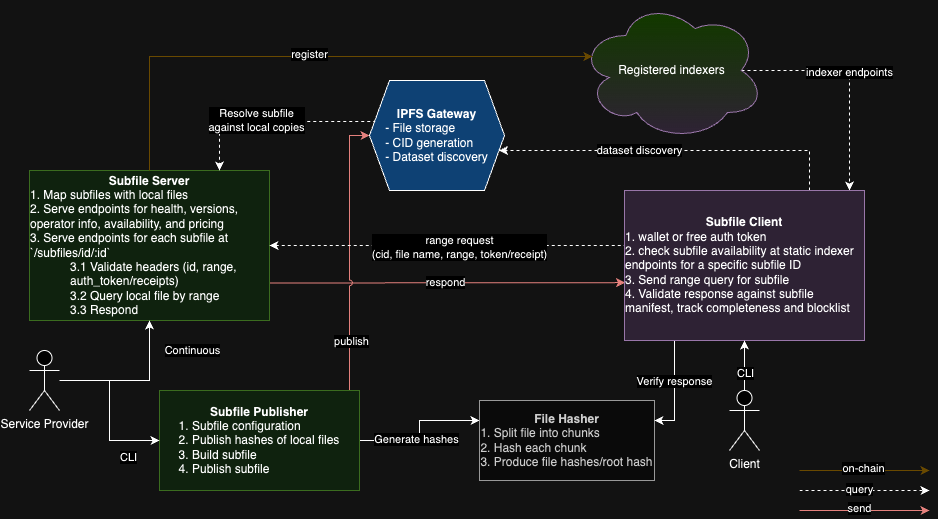

## Architecture and Components

### Decentralized Architecture

Unlike traditional centralized systems where data is stored and managed through a single entity, Subfile-service distributes data across a network of nodes. This decentralization ensures resilience against failures and attacks as there is no single point of failure; it also enhances privacy and control as users are not reliant on a central authority for data management.

The architecture is underpinned by a peer-to-peer (P2P) network framework, where each node in the network can act as a client and/or a server. This setup facilitates direct file sharing among users without the need for intermediaries, and as more users join and contribute to the network, the system becomes more robust and capable of handling larger volumes of data.

### Generic Diagram

### Key Components

1. **File Hasher** ensures data integrity. It uses the SHA2-256 hashing algorithm to process files. The hasher chunks files into manageable sizes (currently 1MB), hashes each chunk, and then organizes these hashes into a Merkle tree structure (Currently we are using an ordered list, but should be relatively simple to update to use the tree structure as it optimizes the verification process ($O(n)$ versus $O(log(n)$ for a single chunk verification where $n$ is the number of chunks), but require 2x memory usage for the hash data structure).

2. **Subfile Publisher** is responsible for preparing and publishing files onto the network. It takes files, processes them through the File Hasher to generate a chunk_file.yaml containing chunk hashes, and then publishes this data to IPFS. The Subfile Builder/Publisher also constructs a subfile manifest, which contains metadata and other relevant information about the files.

3. **IPFS Client** connects to the IPFS network as it is used for posting files to the network and retrieving them. IPFS plays a crucial role in discovering and verifying files, as it allows for content-addressable storage.

4. **Subfile Server** requires an operator mnemonic for initialization and handles various tasks such as retrieving files from IPFS, managing subfiles services, verifying file integrity against chunk hashes, and managing API endpoints. The server also implements routes for various functionalities like health checks, version information, and file availability.

5. **Subfile Client** is used to request and receive files. It handles the construction of requests, including the addition of authentication tokens and, in future iterations, will manage budgeting for file downloads. The client is responsible for ensuring that the received files are complete and authentic by verifying each chunk against the hashes provided by the File Hasher.
