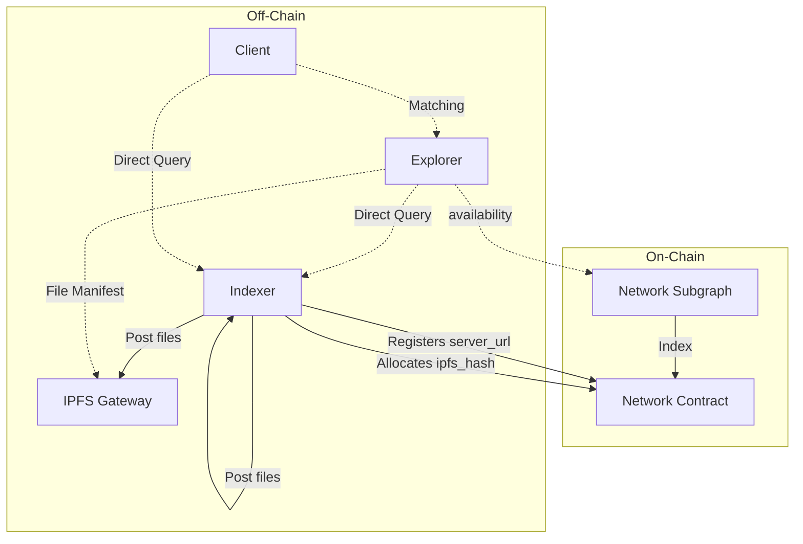

# Discovery

With various packaging methods, types of files, and other types of combinations, we stay focused on discovering and matching file CIDs on/off-chain.



## On-chain

Indexers registers their server url at the registry contract, as this step is crucial in making the Indexer's service discoverable and accessible within the network. We assume Indexer has already registered (through indexer-agent). 

Indexers are expected to create explicit allocation against a specific IPFS hash. The hashes uniquely identify subfiles, acting as a unit identifiable and verifiable between the Indexers and the data requested by consumers. This process ensures that data retrieval is efficiently managed and that Indexers are appropriately allocated to serve specific data needs.

The network subgraph keeps track of all registered Indexers and their active (and closed) allocations. We assume an update to the network subgraph such that `SubgraphDeployment` field gets renamed or encasuplated to a more generic entity such as `DataServiceDeployment` with an additional `dataService` enum field. This addition is essential for querying and filtering information about deployments.

- Identify Available Subfiles: Clients can view all subfiles currently available in the network, along with the Indexers allocated to these subfiles.
- Query Specific Subfiles: Once a desired subfile is identified, clients can make targeted queries pertaining to that subfile and the Indexers actively allocated to it.

With the updated network subgraph, on-chain discovery can be done with flexible queries.

```graphql
query {
// Discover through subfile IPFS hash
subgraphDeployments(where:{ipfsHash: $deployment_ipfs_hash}){
    id
    ipfsHash
    indexerAllocations {
        indexer{
        id
        url
        }
    }
}

// Discover through indexers
indexers {
    allocations(where: {
        dataServiceType: Subfile,
        fileDeployment: $deployment_ipfs_hash
    }) {
        id
        url
        allocatedTokens
        createdAt
        FileDeployment {
            ipfsHash
        }
    }
  }
}

```


## Off-chain

Clients can discover all the available subfiles through the network subgraph, and the allocated indexers. They are responsible for identifying the desired subfiles and making query specific to the subfile and the actively allocated indexers. To gain insights to an IPFS hash, the client might query the IPFS file content to read subfile descriptions and chunk file hashes. 

A client may want to resolve all the available subfile manifest to discover the best fit for their interest, or a client may decide to download a specific file instead of all the files contained in a subfile. Discovery can be made through specific indexer service endpoints or IPFS gateways. 

