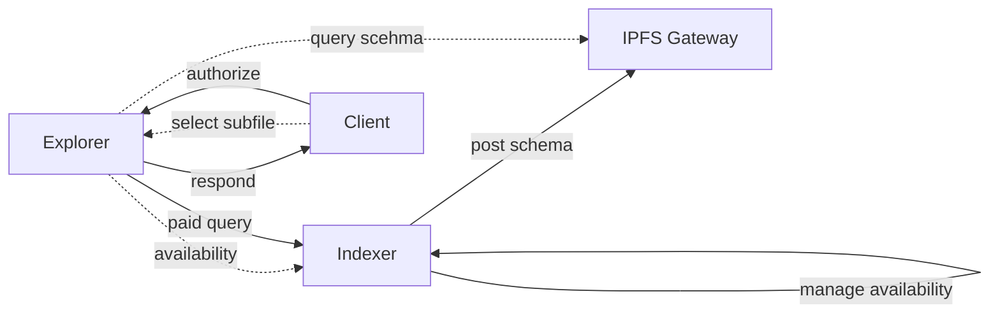

# File Discovery

With various packaging methods, types of files, and other types of combinations, we stay focused on discovering and matching file CIDs on/off-chain.

## Off-chain approach

Indexers serve `/status` endpoint that provides a list of Subfile IPFS hashes, representing the list of available subfiles the local indexer is serving. This is sufficient for matching specific subfiles, but no matching for specific files. 

On the subfile level, the discovery is relatively straightforward for the client, given that they have choosen a subfile IPFS hash to download (`target_subfile`).

1. Client provide a status list of `indexer_endpoints`. Later on, we can add an automatic mode of grabbing all registered indexer service url from the registery contract.

2. Client pings `/operator` and `/status` endpoint for all indexer endpoints. `/operator` will provide the indexer operator and `/status` endpoint will provide the indexer's available subfiles.

    a. if `target_subfile` is in the available subfiles, collect indexer operator and endpoint as an available service

3. Collect a list of available services. Returns early if the list is empty.

We further consider matching files across subfiles so that consumers can be prompted with alternatives if the `target_subfile` is unavailable. This increases file availability by decreasing the criteria for matching a particular service.

Imagine a server serving $subfile_a = {file_x, file_y, file_z}$. Client requests $subfile_b = {file_x}$. The subfile level check will determine that $subfile_a\neq subfile_b$. We add an additional check to resolve $subfile_a$ and $subfile_b$ to chunk file hashes for matching. 

1. Query the content of `target_subfile` for its vector of chunk file hashes

2. Query the content of subfiles served by indexers, create a nested map of indexer to subfiles to files.

3. For each target file, check if there is an indexer serving a subfile that contains the target file. Record the indexer and subfile hash, indexed by the file hash.

4. if there is a target file that unavailable at any indexer/subfile, immediately return unavailability as the target subfile cannot be completed.

5. return the recorded map of file to queriable indexer_endpoint and subfile hash

Later on, we may generate a summary of which subfile has the highest percentage of compatibility. The further automated approach will consist of client taking the recorded availability map and construct range download requests based on the corresponding indexer_endpoint, server subfile, and file hash.

In the diagram below, keep in mind that it is possible for IPFS files (schema files) to be hosted by indexer services as well, which will remove the necessity of using an IPFS gateway. However, for the sake of simplicity and accuracy to the current state of the project, we keep the IPFS gateway component required. 


With an explorer, we can imagine a future discovery user interface along the lines of 



## On-chain approach (unrealized)


**On-chain portion**

Indexers registers their server url at the registry contract, as this step is crucial in making the Indexer's service discoverable and accessible within the network. We assume Indexer has already registered (through indexer-agent). 

Indexers are expected to create explicit allocation against a specific IPFS hash. The hashes uniquely identify subfiles, acting as a unit identifiable and verifiable between the Indexers and the data requested by consumers. This process ensures that data retrieval is efficiently managed and that Indexers are appropriately allocated to serve specific data needs.

The network subgraph keeps track of all registered Indexers and their active (and closed) allocations. We assume an update to the network subgraph such that `SubgraphDeployment` field gets renamed or encasuplated to a more generic entity such as `DataServiceDeployment` with an additional `dataService` enum field. This addition is essential for querying and filtering information about deployments.

- Identify Available Subfiles: Clients can view all subfiles currently available in the network, along with the Indexers allocated to these subfiles.
- Query Specific Subfiles: Once a desired subfile is identified, clients can make targeted queries pertaining to that subfile and the Indexers actively allocated to it.

With the updated network subgraph, on-chain discovery can be done with flexible queries.

```graphql
query {
// Discover through subfile IPFS hash
subgraphDeployments(where:{ipfsHash: $deployment_ipfs_hash}){
    id
    ipfsHash
    indexerAllocations {
        indexer{
        id
        url
        }
    }
}

// Discover through indexers
indexers {
    allocations(where: {
        dataServiceType: Subfile,
        fileDeployment: $deployment_ipfs_hash
    }) {
        id
        url
        allocatedTokens
        createdAt
        FileDeployment {
            ipfsHash
        }
    }
  }
}

```


**Off-chain approach**

Clients can discover all the available subfiles through the network subgraph, and the allocated indexers. They are responsible for identifying the desired subfiles and making query specific to the subfile and the actively allocated indexers. To gain insights to an IPFS hash, the client might query the IPFS file content to read subfile descriptions and chunk file hashes. 

A client may want to resolve all the available subfile manifest to discover the best fit for their interest, or a client may decide to download a specific file instead of all the files contained in a subfile. Discovery can be made through specific indexer service endpoints or IPFS gateways. 


As we keep the diagram simple, it is possible to have indexer serve/host schema files as part of indexer service and become independent of IPFS gateway
