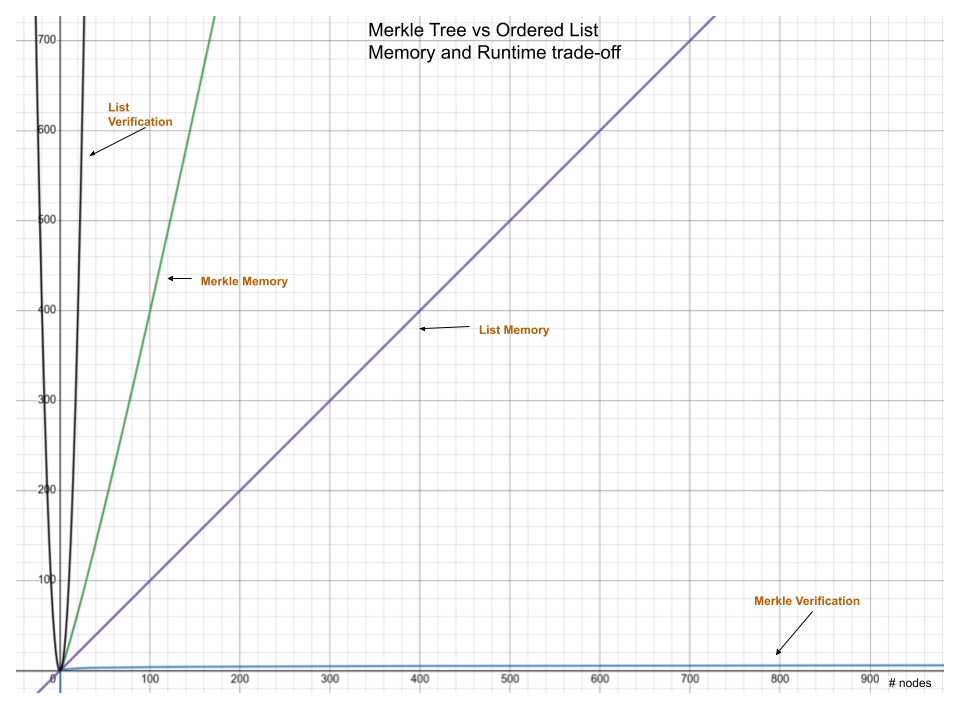

## Manfiest

Structure of Bundle and File Manifests

```mermaid
erDiagram
    Publisher ||..|{ FileManifest : publishes
    FileManifest ||--|| FileMetaInfo : hash
    FileMetaInfo }|--|| SupFile : belongs_to
    Publisher ||..|| SupFile : publishes
    Server }|..|| SupFile : host
    Server }|--|{ FileManifest : resolve
    Client }|..|| SupFile : discover
    Client }|..|| Server : request
    Client }|--|{ FileManifest : validate

    FileManifest {
        u64 total_bytes
        u64 chunk_size
        VecString chunk_hashes
    }
    Publisher {
        String read_dir
        String bundle_name
        VecString file_names
        String file_type
        String file_version
        OptionString identifier
        u64 chunk_size
        Optionu64 start_block
        Optionu64 end_block
        String description
        String chain_id
    }
    FileMetaInfo {
        String name
        String hash
    }

    SupFile {
        VecFileMetaInfo files
        String file_type
        String spec_version
        String description
        String chain_id
        BlockRange block_range
    }

    Server {
        String host
        usize port
        VecString bundles
        OptionString free_query_auth_token
        OptionString admin_auth_token
        String mnemonic
    }

    Client {
        String supfile_hash
        VecString server_endpoints
        String main_dir
        OptionString free_query_auth_token
        u64 max_retry
    }
    
```

A file will have the same File manifest CID if they share the same content, chunked by the same size, and with the same hashing scheme; the file name and publisher properties will not affect the file manifest CID.

The CID for the Bundle can vary based on the makeup of the files and meta information about the set of the files. 

While servers and clients can simply exchange a published bundle by the exact files contained, we expect the possibility to match availability on a file manifest CID level, so the server serving a bundle with overlapping set of files with the target bundle can still provide for the overlapping content. 


### Verification options

In schema files, the publisher will directly post an ordered list of data chunk hashes. The file content that can be verified through the ordered list itself, or verified after constructing a 
Merkle tree by taking the list as the leave nodes. 

If the ordered list is posted publicly, let hash length be constant and $m$ be the number of hashes, then the content is strictly the hash length times number of hashes, $O(m)$. Verification runtime for a single hash deterministically is $O(m)$ while verification runtime for the full list is $O(m^2)$.

If the Merkle tree is posted publicly, the content size is doubled as there will be $\log(m)$ levels and $2^i$ nodes per level for level $i$, counting from root. This adds up to $2m-1$ which leads to $O(m)$. For verification, the verifier must create a Merkle proof for each leave node, by tracing the path from the specific leaf node up to the root, collecting a sibling hash at each level. Therefore, the runtime complexity for generating a Merkle proof is $O(\log(m))$, the memory required to keep a Merkle proof is $O(\log(m))$, and the runtime complexity to verify a hash against a Merkle proof is also $O(\log(m))$. Thus the memory requirement adds up to be $O(m + k\log(m))$ where $1\leq k\leq m$ is the degree of parallelization. The verification requirement for all chunks is $O(m\log(m))$.

Optionally, the verifier can generate the Merkle tree locally using the ordered list.

To summarize, memory and runtime complexity involved with either methods can be generalized as follows, where $m$ is the number of nodes (hashes), taking the size of a node and complexity of hashing to be constant.

| | Memory | Verification |
| --- | --- | --- |
| 1 chunk in list | $O(m)$ | $O(m)$ | 
| all chunk in list | $O(m)$ | $O(m^2)$ | 
| 1 chunk in tree | $O(2m-1+\log(m)) \rightarrow O(m) $ | $O(\log(m))$ | 
| all chunk in tree | $O(2m-1+m\log(m)) \rightarrow O(m\log(m))$ | $O(m\log(m))$ | 


To find the optimal point of either solution, we consider a list with $m$ hashes. This list can be either chunk hashes or file hashes.

For optimal memory, comparing $O(m)=O(2m-1+log(m))$ and $m=2m-1+log(m)$, memory requirement is less strict for ordered list when $m> 1$.

For optimal verification, comparing $O(m^2)$ and $O(m\log(m))$, Merkle tree always performs better for runtime complexity. 

Depending on the package sizes and client requirements, different validation methods can be used.



### Manifest examples

#### Bundle manifest

https://ipfs.network.thegraph.com/api/v0/cat?arg=QmeaPp764FjQjPB66M9ijmQKmLhwBpHQhA7dEbH2FA1j3v
```
files:
- name: example-create-17686085.dbin
  hash: QmeKabcCQBtgU6QjM3rp3w6pDHFW4r54ee89nGdhuyDuhi
- name: 0017234500.dbin.zst
  hash: QmeE38uPSqT5XuHfM8X2JZAYgDCEwmDyMYULmZaRnNqPCj
- name: 0017234600.dbin.zst
  hash: QmWs8dkshZ7abxFYQ3h9ie1Em7SqzAkwtVJXaBapwEWqR9
file_type: flatfiles
spec_version: 0.0.0
description: random flatfiles
chain_id: '0'
block_range:
  start_block: null
  end_block: null
```

#### File manifest schema

https://ipfs.network.thegraph.com/api/v0/cat?arg=QmeE38uPSqT5XuHfM8X2JZAYgDCEwmDyMYULmZaRnNqPCj
```
total_bytes: 24817953
chunk_size: 1048576
chunk_hashes:
- /5jJskCMgWAZIZHWBWcwnaLP8Ax4sOzCq6d9+k2ouE8=
- tgs2sJ7RPrB1lhmSQWncez9XuL8esCxJLzwsogAVoPw=
- ...
```
