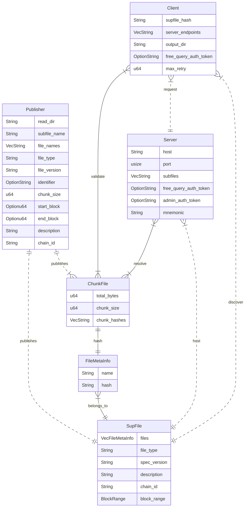
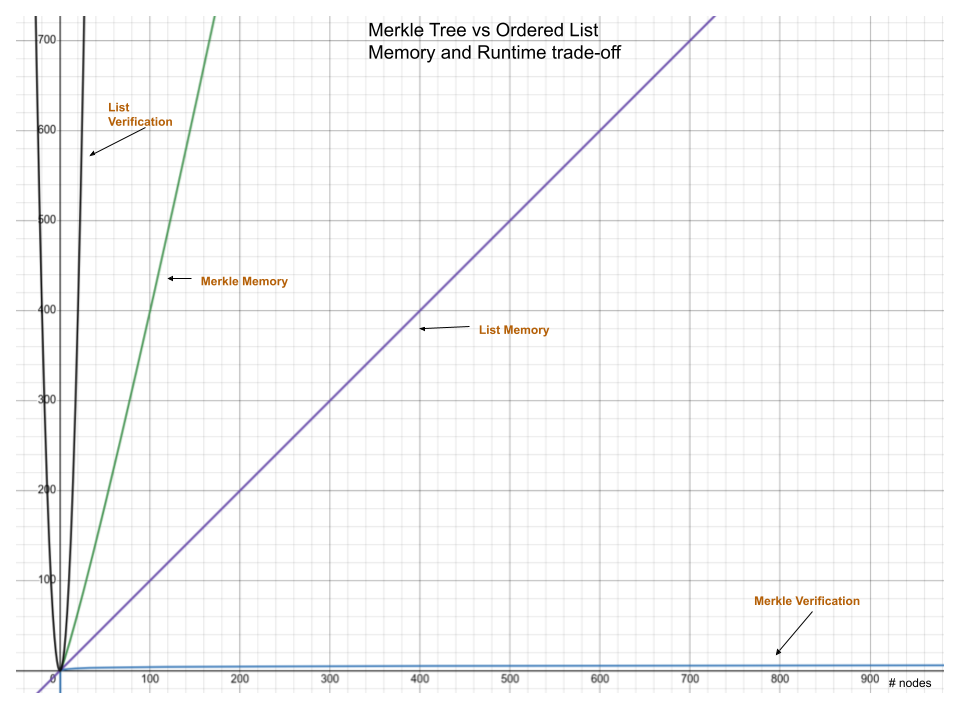

## Subfile manfiest specifications

Structure of subfile and chunk files



A file will have the same Chunk file CID if they share the same content, chunked by the same size, and with the same hashing scheme; the file name and publisher properties will not affect the chunk file CID.

The CID for the subfile can vary based on the makeup of the files and meta information about the set of the files. 

While servers and clients can simply exchange a published subfile by the exact files contained, we expect the possibility to match availability on a chunk file CID level, so the server serving a subfile with overlapping set of files with the target subfile can still provide for the overlapping content. 


### Verification options

In schema files, the publisher will directly post an ordered list of data chunk hashes. The file content that can be verified through the ordered list itself, or verified after constructing a 
Merkle tree by taking the list as the leave nodes. 

If the ordered list is posted publicly, let hash length be constant and $m$ be the number of hashes, then the content is strictly the hash length times number of hashes, $O(m)$. Verification runtime for a single hash deterministically is $O(m)$ while verification runtime for the full list is $O(m^2)$.

If the Merkle tree is posted publicly, the content size is doubled as there will be $\log(m)$ levels and $2^i$ nodes per level for level $i$, counting from root. This adds up to $2m-1$ which leads to $O(m)$. For verification, the verifier must create a Merkle proof for each leave node, by tracing the path from the specific leaf node up to the root, collecting a sibling hash at each level. Therefore, the runtime complexity for generating a Merkle proof is $O(\log(m))$, the memory required to keep a Merkle proof is $O(\log(m))$, and the runtime complexity to verify a hash against a Merkle proof is also $O(\log(m))$. Thus the memory requirement adds up to be $O(m + k\log(m))$ where $1\leq k\leq m$ is the degree of parallelization. The verification requirement for all chunks is $O(m\log(m))$.

Optionally, the verifier can generate the Merkle tree locally using the ordered list.

To summarize, memory and runtime complexity involved with either methods can be generalized as follows, where $m$ is the number of nodes (hashes), taking the size of a node and complexity of hashing to be constant.

| | Memory | Verification |
| --- | --- | --- |
| 1 chunk in list | $O(m)$ | $O(m)$ | 
| all chunk in list | $O(m)$ | $O(m^2)$ | 
| 1 chunk in tree | $O(2m-1+\log(m)) \rightarrow O(m) $ | $O(\log(m))$ | 
| all chunk in tree | $O(2m-1+m\log(m)) \rightarrow O(m\log(m))$ | $O(m\log(m))$ | 


To find the optimal point of either solution, we consider a list with $m$ hashes. This list can be either chunk hashes or file hashes.

For optimal memory, comparing $O(m)=O(2m-1+log(m))$ and $m=2m-1+log(m)$, memory requirement is less strict for ordered list when $m> 1$.

For optimal verification, comparing $O(m^2)$ and $O(m\log(m))$, Merkle tree always performs better for runtime complexity. 

Depending on the package sizes and client requirements, different validation methods can be used.



### Current manifest

#### Subfile manifest

https://ipfs.network.thegraph.com/api/v0/cat?arg=QmeaPp764FjQjPB66M9ijmQKmLhwBpHQhA7dEbH2FA1j3v
```
files:
- name: example-create-17686085.dbin
  hash: QmeKabcCQBtgU6QjM3rp3w6pDHFW4r54ee89nGdhuyDuhi
- name: 0017234500.dbin.zst
  hash: QmeE38uPSqT5XuHfM8X2JZAYgDCEwmDyMYULmZaRnNqPCj
- name: 0017234600.dbin.zst
  hash: QmWs8dkshZ7abxFYQ3h9ie1Em7SqzAkwtVJXaBapwEWqR9
file_type: flatfiles
spec_version: 0.0.0
description: random flatfiles
chain_id: '0'
block_range:
  start_block: null
  end_block: null
```

#### Chunk file schema

https://ipfs.network.thegraph.com/api/v0/cat?arg=QmeE38uPSqT5XuHfM8X2JZAYgDCEwmDyMYULmZaRnNqPCj
```
total_bytes: 24817953
chunk_size: 1048576
chunk_hashes:
- /5jJskCMgWAZIZHWBWcwnaLP8Ax4sOzCq6d9+k2ouE8=
- tgs2sJ7RPrB1lhmSQWncez9XuL8esCxJLzwsogAVoPw=
- ...
```
