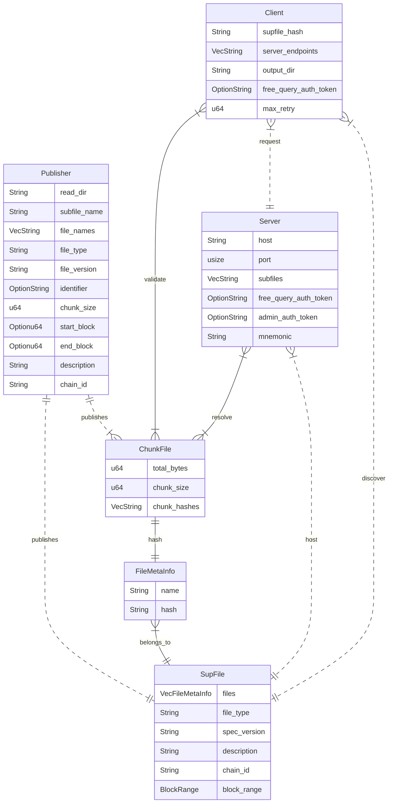

## Subfile manfiest specifications

Structure of subfile and chunk files



A file will have the same Chunk file CID if they share the same content, chunked by the same size, and with the same hashing scheme; the file name and publisher properties will not affect the chunk file CID.

The CID for the subfile can vary based on the makeup of the files and meta information about the set of the files. 

While servers and clients can simply exchange a published subfile by the exact files contained, we expect the possibility to match availability on a chunk file CID level, so the server serving a subfile with overlapping set of files with the target subfile can still provide for the overlapping content. 


### Packaging options

- Each flatfile is verified against a chunk_file which contains an ordered list of hashes for every chunk of data. Then, subfile manifest contains a map of flatfile name to chunk_file IPFS
- Each flatfile is verified against the root of a merkle tree, in which a chunk request can be verified through generating a merkle proof (if the merkele tree is posted publicly then anyone can be a proofer; otherwise the server must provide the proof). The subfile manifest contains a map for flatfile name to flatfile merkle root
- Each flatfile is verified against the root of a merkle tree, in which a chunk request can be verified through generating a merkle proof. The subfile manifest contains a merkle root of flatfile roots, in which the merkle tree is posted in a separate file. (Full Merkle tree should available for public access especially if individual flatfile tree is already public. Otherwise the server must serve all chunk and file checks).
- Each flatfile is verified against a chunk_file which contains an ordered list of hashes for every chunk of data. The subfile manifest contains a merkle root of chunk_file CID, in which the merkle tree is posted in a separate file.

In short

| | Ordered list | Merkle Tree | 
| --- | --- | --- | 
| File verification | $O(m^2)$ | $O(m\log(m))$ |
| File memory | $O(m)$ | $O(2m-1)$ |
| Package verification | $O(n^2)$ | $O(n\log(n))$ |
| Package memory | $O(n)$ | $O(2n-1)$ |

Where $m$ is the number of chunks for a file ($\frac{\text{file size}}{\text{chunk size}}$), $n$ is the number of files in a package.


### Calculations

Variables: 
- $M$ - total bytes,
- $n$ - number of files in a subfile, 
- $s$ - size of the file, 
- $c$ - chunk size,
  
Hashing a vector of bytes of length $c$ takes $O(c)$. Checking hash with a constant length is $O(1)$.

Take constant assumptions: 
- average file size be $30\text{Mb}$, 
- hash size $256\text{bits} = 32\text{bytes}$.

Total number of files: $N=\frac{M}{30\text{Mb}}$

| N | n | c | packaging option | Verifier runtime | Verifier memory | Proofer runtime | Proofer memory |
| ---------------- | ---------------- | --------------------------- | ----------------- |----------------- | ----------------- | ----------------- | ----------------- |
| 185K | 1,000                | 1Mb | L+L | $O((\frac{s}{c})^2)$ | $O(sn)$ | ...


M=5TB, N=1000, c=1MB => 

~5million chunks, 160 MB for hashes not including positioning
M=5TB, c=10MB, lower bound by file size 25MB => 16-19.2MB for hashes not including positioning

Merkel proof with roots


## Hypotheticals

**Objective**: Minimize the total computational complexity and memory usage for verifying flatfiles against their chunk file hashes in a subfile.

**Assumptions**:
- Total Dataset Size ($D$): $5TB = 5,120,000 MB$
- Average Flatfile Size ($F$): $30MB$
- Chunk Size ($C$): $1MB$
- Number of Chunks per Flatfile ($M$): $30$ (since $F/C = 30MB/1MB$)
- Total Number of Flatfiles in the Dataset ($N$): $170,667$ (approximately, since $D/F = 5,120,000MB/30MB$)
- On-Chain Cost per Subfile: Assumed to be a constant: $K$

**Variables**:
- Number of Flatfiles per Subfile ($X$)

### Scenario 1: Chunk hash in list, File hash in list

**Formulas**:
- File Verification Complexity per Flatfile: $O(m^2)$ where $m = 30$ (number of chunks)
- File Memory Usage per Flatfile: $O(m)$
- Total Complexity for $X$ Flatfiles in a Subfile: $O(X^2m^2)$
- Total Memory Usage for $X$ Flatfiles in a Subfile: $O(Xm)$

**Optimization objective**

Combines memory, computational complexity, and on-chain costs using weights, $w_m$, $w_c$, and $w_o$, respectively.

The combined metric for a subfile is then:
$$\argmin_{X\in(1, N)}\space Obj(X) = w_m  (O(XM)) + w_c (O(X^2M^2)) + w_o \left( \frac{N}{X} \times K \right)$$


*Example Calculation 1*

We first simplify the problem by assigning a few values. Let $w_m=1$, $w_c=2$, $w_o=1$, $k=1$. Generally, the weights should be determined based on system constraints or performance goals.

$$1 * (X \times 30) + 2 * (X \times 30^2) + 1 * \left( \frac{170,667}{X} \times 1 \right)
= 30X + 1800X + \frac{170,667}{X}$$

Differentiation and Solving for X
$$\frac{d}{dX} \left( 30X + 1800X + \frac{170,667}{X} \right) = 0 \\ 
30 + 1800 - \frac{170,667}{X^2} = 0 \\
X = \sqrt{\frac{170,667}{1830}} \approx 9.66 $$

*Example Calculation 2*

Let $w_m=1$, $w_c=2$, $w_o=1$, $k=100$. 

$$1 * (X \times 30) + 2 \times (X \times 30^2) + 1 \times \left( \frac{170,667}{X} \times 100 \right)
=  30X + 1800X + \frac{17,066,700}{X}$$

Differentiation and Solving for X
$$\frac{d}{dX} \left( 30X + 1800X + \frac{17,066,700}{X} \right) = 0 \\
30 + 1800 - \frac{17,066,700}{X^2} = 0 \\
X = \sqrt{\frac{17,066,700}{1830}} \approx 96.59 $$

For X = 97, $Obj(97)= 353,451.24$.


### Scenario 2: Chunk Hash in Merkle Tree, File Hash in Merkle Tree

**Formulas**:
- File Verification Complexity per Flatfile: $O(M\log(M))$ where $M = 30$ (number of chunks in a Merkle tree)
- File Memory Usage per Flatfile: $O(2M - 1)$ (size of a Merkle tree)
- Total Complexity for $X$ Flatfiles in a Subfile: $X \times O(\log(X))$
- Total Memory Usage for $X$ Flatfiles in a Subfile: $X \times O(2X - 1)$

**Optimization objective**

Combines memory, computational complexity, and on-chain costs using weights, $w_m$, $w_c$, and $w_o$, respectively.

The combined metric for a subfile is then:
$$\argmin_{X\in(1, N)}\;\; Obj(X) = w_m  (X \times O(M)) + w_c (X \times O(M^2)) + w_o \left( \frac{N}{X} \times K \right)$$


### Subfile Manfiest 
```
dataSources: // list of files
  - kind: ethereum/flatfile // the kind of files shared
    providerVersion: [version] // version used by indexing method; i.e. firehose versioning
    provider: firehose
    source: // chunk files
      chunkFile: 
        startBlock: ...
        endBlock: ...
        pieceLength: // number of bytes per piece
        length: // Total bytes of the file 
        rootHash: // markle root hash for the file
        /: /ipfs/[Qm...] 
    language: [...]
    name: EthereumFirehose
    network: ethereum
description: "..."
features:
  - Tracing
publisher_url: [persisted url of the publisher status]
specVersion: [subfile version]
```


abis file

```
[
  {
    "inputs": [],
    "stateMutability": "nonpayable",
    "type": "constructor"
  },
  {
    "anonymous": false,
    "inputs": [
      {
        "indexed": true,
        ...
      }, ...
    ]
  },...
]
```

...


### CLI command for the populating manifest

One of these is required, conflict with each other
file_path: Option<String>,   // Path to the file/directory to seed
file_link: Option<String>,   // Previously generated magnet link

These can be interactive, subcommand, or parsed from a config file
name: Option<String>,        // Name to give the torrent file
file_type: String,           // flatfiles and such, TODO: replace with an enum for supported types
file_version: String,        // User specify the torrent version
identifier: String,          // Describe a commonly available unit (firehose Ethereum chain, or subgrpah deployment hash, ...)
start_block: Option<u64>,    // Flatfiles require a start block
end_block: Option<u64>,      // Flatfiles require an end block, snapshots can utilize it as target_block
trackers: Vec<String>, // A list of trackers to announce data availability to, we should provide a set of defaults
subfile_store_path: String, // The path to store subfile.yaml once it has been generated


### Current manifest


#### Subfile manifest

https://ipfs.network.thegraph.com/api/v0/cat?arg=QmeaPp764FjQjPB66M9ijmQKmLhwBpHQhA7dEbH2FA1j3v
```
files:
- name: example-create-17686085.dbin
  hash: QmeKabcCQBtgU6QjM3rp3w6pDHFW4r54ee89nGdhuyDuhi
- name: 0017234500.dbin.zst
  hash: QmeE38uPSqT5XuHfM8X2JZAYgDCEwmDyMYULmZaRnNqPCj
- name: 0017234600.dbin.zst
  hash: QmWs8dkshZ7abxFYQ3h9ie1Em7SqzAkwtVJXaBapwEWqR9
file_type: flatfiles
spec_version: 0.0.0
description: random flatfiles
chain_id: '0'
block_range:
  start_block: null
  end_block: null
```

#### Chunk file schema

https://ipfs.network.thegraph.com/api/v0/cat?arg=QmeE38uPSqT5XuHfM8X2JZAYgDCEwmDyMYULmZaRnNqPCj
```
total_bytes: 24817953
chunk_size: 1048576
chunk_hashes:
- /5jJskCMgWAZIZHWBWcwnaLP8Ax4sOzCq6d9+k2ouE8=
- tgs2sJ7RPrB1lhmSQWncez9XuL8esCxJLzwsogAVoPw=
- ...
```


## Strike to be more like subgraph.yaml

Ideas
- [ ] camel case
- [ ] `version` -> `specVersion` / `spec_version`
- [ ] description
- [ ] dataSources array
  - [ ] kind (subgraph deployment snapshot)
  - [ ] name (subgraph name)
  - [ ] network
  - [ ] block range (subgraph indexing network)
  - [ ] source:
    - [ ] address: deployment hash
    - [ ] abi: subgraph graphQL schema
    - [ ] snapshot_block

Optional
- [ ] repository
- [ ] schema: file: ./schema.graphql
- [ ] mapping: (directory composition of files)

### Referencing subgraph.yaml

https://ipfs.network.thegraph.com/api/v0/cat?arg=Qmc1mmagMJqopw2zb1iUTPRMhahMvEAKpQGS3KvuL9cpaX

manifest
```
dataSources:
  - kind: ethereum/contract
    mapping:
      abis:
        - file:
            /: /ipfs/QmQoSyqRFYk12SDrEXDo3d1pwGzNwMkbu6xRjscZZrpeoi
          name: Controller
      apiVersion: 0.0.7
      entities:
        - Indexer
      eventHandlers:
        - event: 'SetContractProxy(indexed bytes32,address)'
          handler: handleSetContractProxy
      file:
        /: /ipfs/QmYQm7DcFCtq7erXuH4obV7e3nMAphVqrCiDVGEck3Hyc8
      kind: ethereum/events
      language: wasm/assemblyscript
    name: Controller
    network: arbitrum-goerli
    source:
      abi: Controller
      address: '0x7f734E995010Aa8d28b912703093d532C37b6EAb'
      startBlock: 1023264
  - kind: ...
description: The Graph Network Smart Contracts on Ethereum
features:
  - ipfsOnEthereumContracts
  - fullTextSearch
repository: 'https://github.com/graphprotocol/graph-network-subgraph'
schema:
  file:
    /: /ipfs/QmVWxUnF6vxf4xUfrg6ferLr2tU6iAsY7wJBmtzQpqu3rd
specVersion: 0.0.5
```